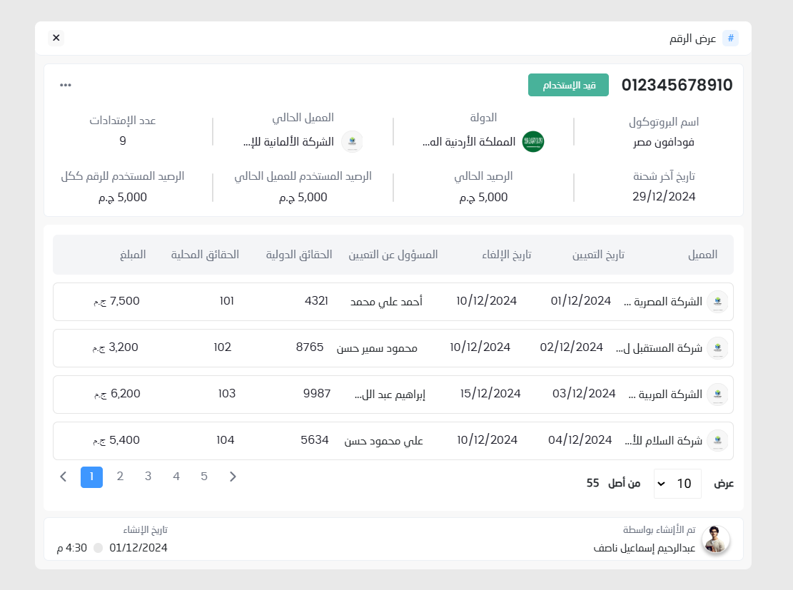

# View Number  



A web-based application for viewing and managing user information, including financial data, assignments, and related statistics.  

## Features  

- **User Details**: Displays comprehensive user information, including:  
  - Name and protocol information  
  - Country and affiliated organization  
  - Financial balances and credits  
  - Account creation and update dates  

- **Transaction History**: A table view of detailed financial and assignment-related data, featuring:  
  - Transaction amounts  
  - Responsible individuals and designation dates  
  - Relevant agreements (local and international)  

- **Pagination**: Easily navigate through the records using a clean and responsive pagination interface.  

- **Responsive Design**: The interface adapts to different screen sizes for an optimal user experience.  

## Technologies Used  

- **Frontend**:  
  - HTML, SCSS, TypeScript  
  - Angular framework  


## How to Use  

1. Clone the repository:  
   ```bash  
   git clone https://github.com/Mostafa7ahmed/viewNumber.git  

# View Number  

A web-based application for viewing and managing user information, including financial data, assignments, and related statistics.  

## Features  

- **User Details**: Displays comprehensive user information, including:  
  - Name and protocol information  
  - Country and affiliated organization  
  - Financial balances and credits  
  - Account creation and update dates  

- **Transaction History**: A table view of detailed financial and assignment-related data, featuring:  
  - Transaction amounts  
  - Responsible individuals and designation dates  
  - Relevant agreements (local and international)  

- **Pagination**: Easily navigate through the records using a clean and responsive pagination interface.  

- **Responsive Design**: The interface adapts to different screen sizes for an optimal user experience.  

## Technologies Used  

- **Frontend**:  
  - HTML, SCSS, TypeScript  
  - Angular framework  

- **Backend**: [If applicable, mention here]  
- **Database**: [If applicable, mention here]  

## How to Use  

1. Clone the repository:  
   ```bash  
   git clone https://github.com/Mostafa7ahmed/viewNumber.git  
